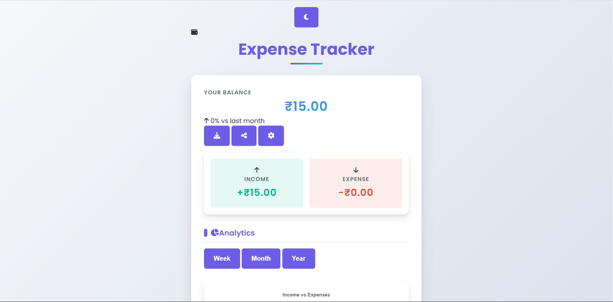

# Expenditure Manager

A simple and interactive expense tracking app built with **JavaScript**, **HTML**, and **CSS**.

---

## 🚀 Features

- Add, edit, and delete expenses with ease
- Visual dashboard for quick insights
- Categorize your expenditures
- Responsive design for desktop and mobile
- Data persistence in local storage

---

## 🏠 Homepage Screenshot


> _Add a screenshot of your homepage as `homepage.png` in the root directory to display it here._

---

## 🛠️ Getting Started

1. **Clone the repository:**
   ```bash
   git clone https://github.com/idivyanshdubey/Expenditure-Manager.git
   cd Expenditure-Manager
   ```

2. **Open `index.html` in your browser:**
   - No build steps required!
   - Just double-click `index.html`, or use a local server for best results.

---

## 📂 Project Structure

```
Expenditure-Manager/
├── index.html
├── style.css
├── script.js
├── homepage.png  <-- (Add your screenshot here)
└── README.md
```

---

## 💡 Usage

- Click “Add Expense” to log a new transaction.
- View, edit, or remove expenses from the list.
- See your total spend and breakdown by category on the dashboard.

---

## 🤝 Contributing

Pull requests are welcome! For major changes, open an issue first to discuss what you would like to change.

---

## 📃 License

MIT

---

## 🙋 Questions?

Open an [issue](https://github.com/idivyanshdubey/Expenditure-Manager/issues) for help or suggestions.

---
